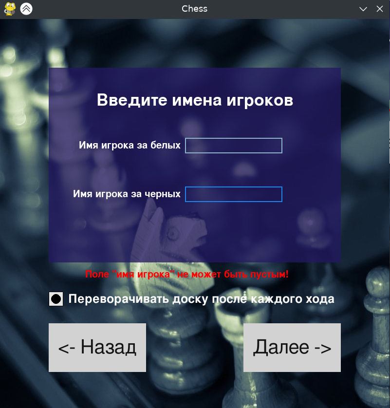

# Проект "Шахматы"
## Описание:
Данные проект был создан автором в рамках учебной программы [Лицея Академии Яндекса](https://academy.yandex.ru/lyceum/).
Он представляет собой шахматную игру с графическим интерфейсом для игры двух пользователей. 
Игра реализована на языке программирования [**Python**](https://pythohn.org).
1. Игра двух пользователей
2. Полная реализация шахматной логики, включающая в себя 
    - Проверку на шах
    - Проверку на мат
    - Проверку на пат
    - Проверку на взятие на проходе
    - Проверку на рокировку
    - Проверку на возможность хода
    - Проверку на ничью из-за троекратного повторения позиции
    - Проверку на ничью из-за 50 ходов
3. Возможность ввода имен игроков 
4. Сохранение и возможность просмотра результатов игры
5. Возможность отмены хода
6. Возможность выхода из игры в любой момент
7. Возможность масштабирования игрового поля
8. Подсветка возможных ходов, а также особое выделение ходов, которые приведут ко взятию фигуры противника
9. Возможность отключения перевората фигур после каждого хода

## Техническая информация:
Данный проект был создан с использованием следующих библиотек:
1. [Pygame](https://www.pygame.org/news) (требует установки)
2. [sqlite3](https://docs.python.org/3/library/sqlite3.html) (не требует установки)

Необходимые для установки библиотеки находятся в файле [requirements.txt](./requirements.txt)

Проект содержит следующие файлы:
1. [new_main.py](./new_main.py) - основной файл, в котором происходит запуск игры и ее отрисовка
2. [board.py](./board.py) - файл, в котором реализована логика игры
3. [config.py](./config.py) - файл, в котором хранятся константы, используемые в проекте
4. [database.py](./database.py) - файл, в котором реализована работа с базой данных
5. [figures.py](./figures.py) - файл, в котором реализована основная логика всех фигур
6. [King.py](./King.py) - файл, в котором реализована логика короля (расширяет класс Figure)
7. [Knight.py](./Knight.py) - файл, в котором реализована логика коня (расширяет класс Figure)
8. [Pawn.py](./Pawn.py) - файл, в котором реализована логика пешки (расширяет класс Figure)
9. [Queen.py](./Queen.py) - файл, в котором реализована логика ферзя (расширяет класс Figure)
10. [Rook.py](./Rook.py) - файл, в котором реализована логика ладьи (расширяет класс Figure)
11. [Bishop.py](./Bishop.py) - файл, в котором реализована логика слона (расширяет класс Figure)
12. [TempFigure.py](./TempFigure.py) - файл, в котором реализована логика временной фигуры (расширяет класс Figure, используется для проверки возможного хода)
13. [Move.py](./Move.py) - файл, в котором реализована логика хода
14. [inputbox.py](./inputbox.py) - файл, в котором реализована логика поля для ввода текста (дополнительный графический элемент)
15. [button.py](./button.py) - файл, в котором реализована логика кнопки (дополнительный графический элемент)
16. [background.py](./background.py) - файл, в котором реализована логика фона
17. [gameresults.sqlite3](./gameresults.sqlite3) - файл, в котором хранятся результаты игр
18. [check_box.py](./checkbox.py) - файл в котором реализована логика чекбокса (в программе используется для опции "переворачивать доску после каждого хода")

Также проект содержит следующие папки:
1. [images](./images) - папка, в которой хранится изображение фона
2. [sounds](./sounds) - папка, в которой хранятся звуки, используемые в проекте
3. [sprites](./sprites) - папка, в которой хранятся изображения фигур
4. [game_process_photos](./game_process_photos) - папка, в которой хранятся скриншоты игрового процесса
## Запуск:
Для запуска игры необходимо скачать файлы проекта в примере используется команда git clone:
```bash
git clone https://github.com/holodnayazvezda/yandex_lyveum_pygame_project_chess.git
```
После этого перейти в каталог с файлами программы и установить все зависимости:
```bash
cd yandex_lyveum_pygame_project_chess && pip install -r requirements.txt
```
После этого запустить файл [new_main.py](./new_main.py) командой:
```bash
python new_main.py
```

## Скриншоты игры:
Скриншот начального экрана, когда информация о последних играх отсутствует (gameresults.sqlite3 пустой или отсутствует):

Скриншот начального экрана, когда информация о последних играх присутствует (gameresults.sqlite3 не пустой):

Скриншот экрана ввода имени игроков:

Скриншот экрана игры:

Скриншот экрана выхода из игры:

Скриншот экрана окончания игры (мат)

Скриншот экрана окончания игры (ничья из-за троекратного повторения позиции)
